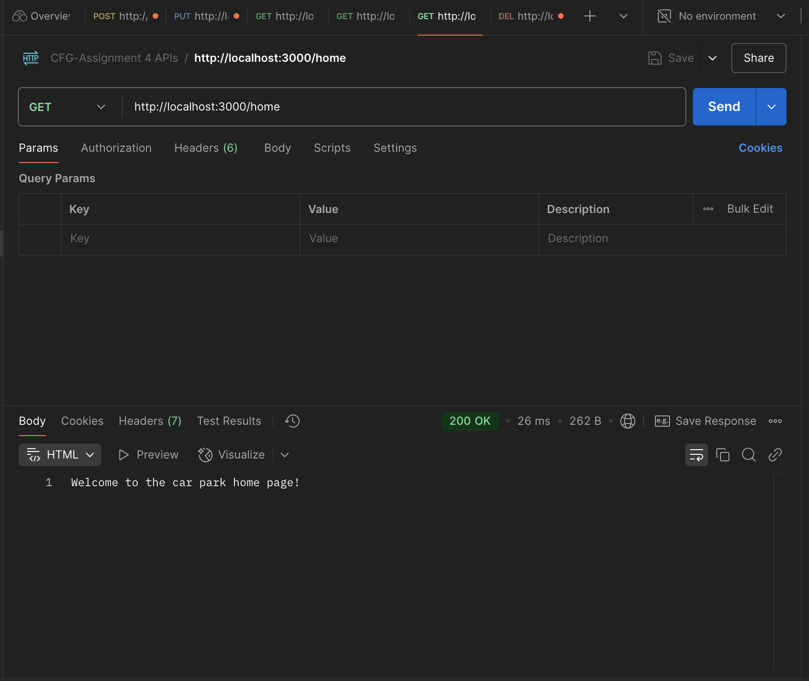
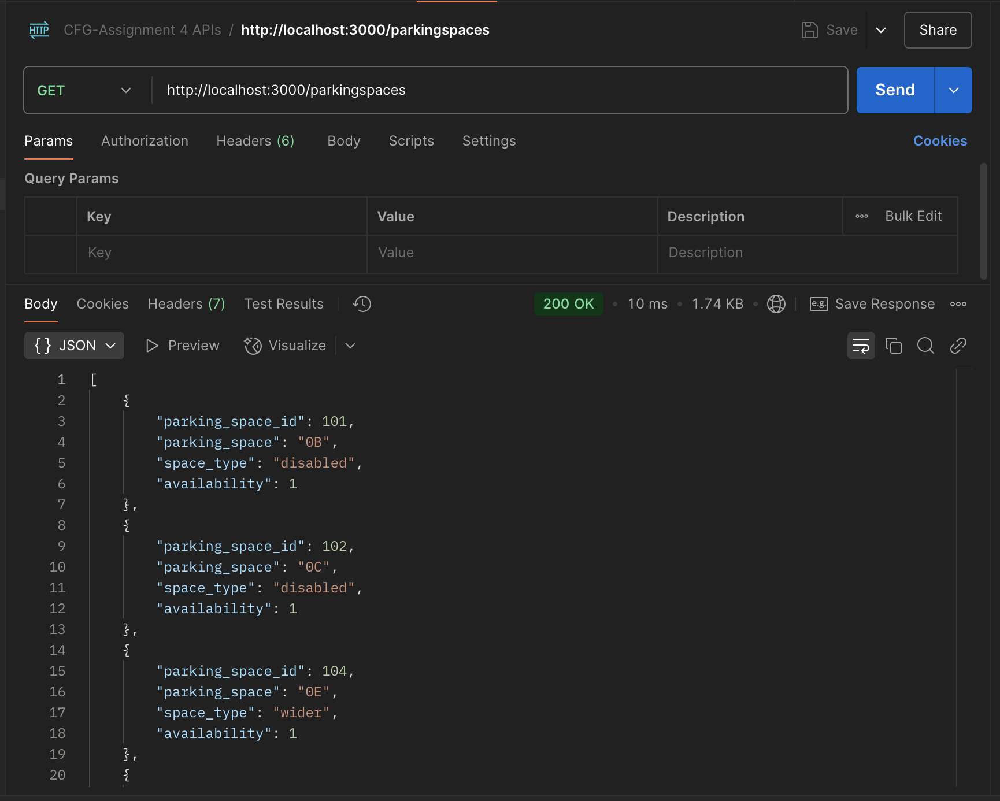
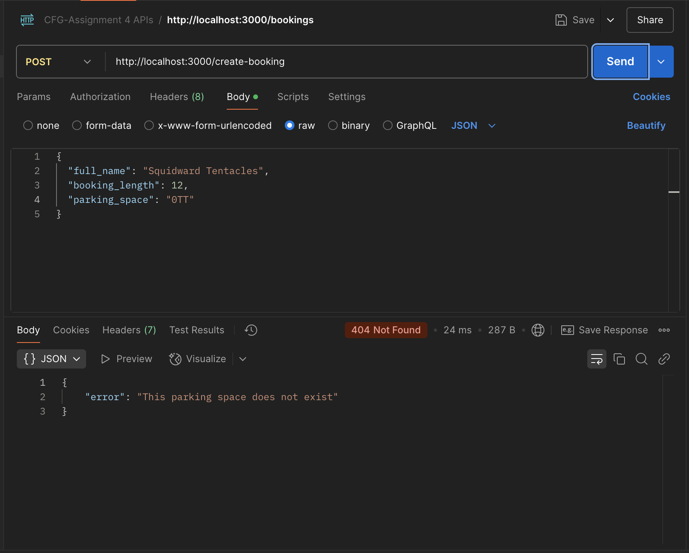
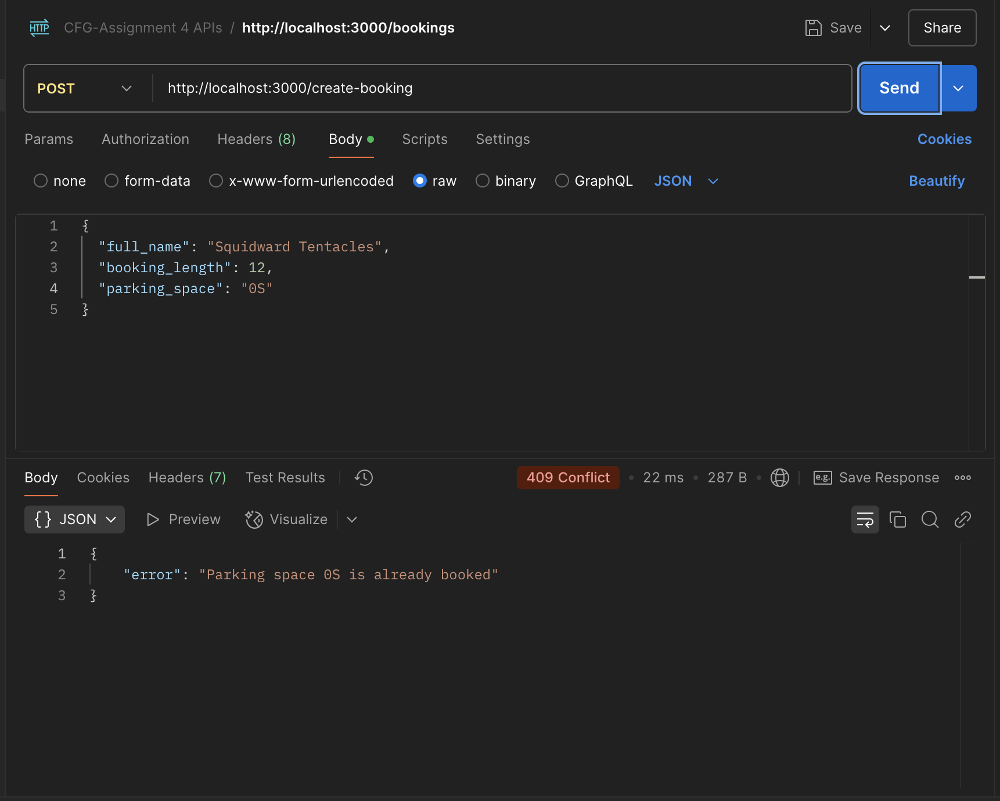
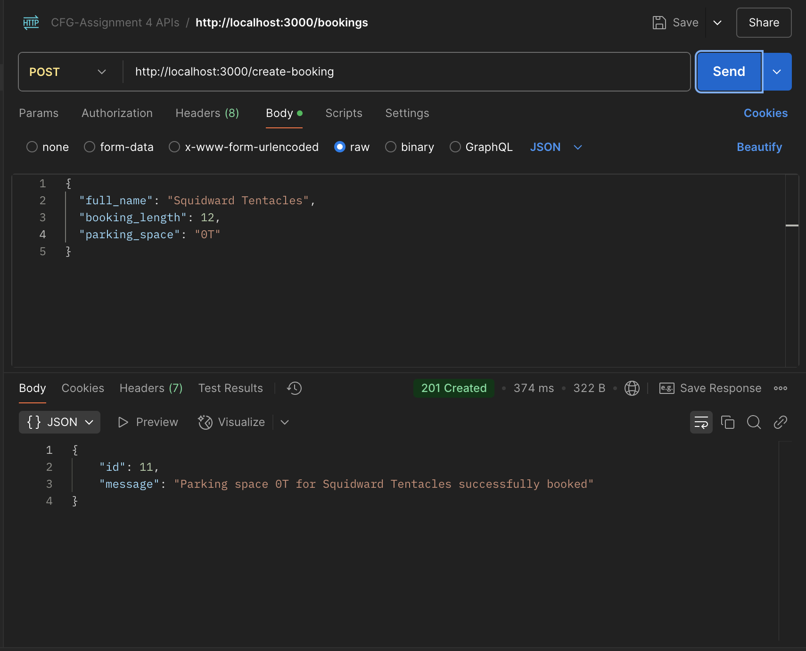
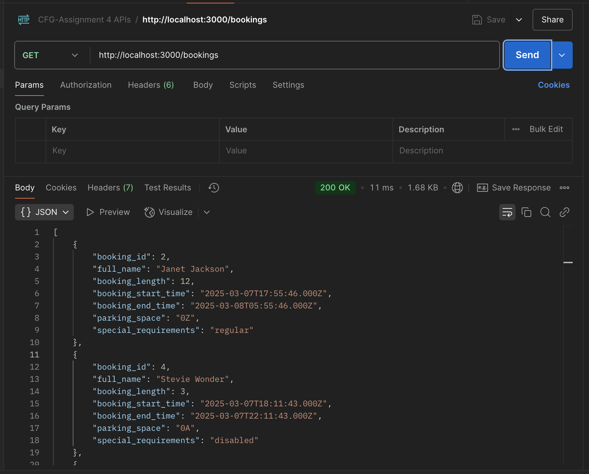
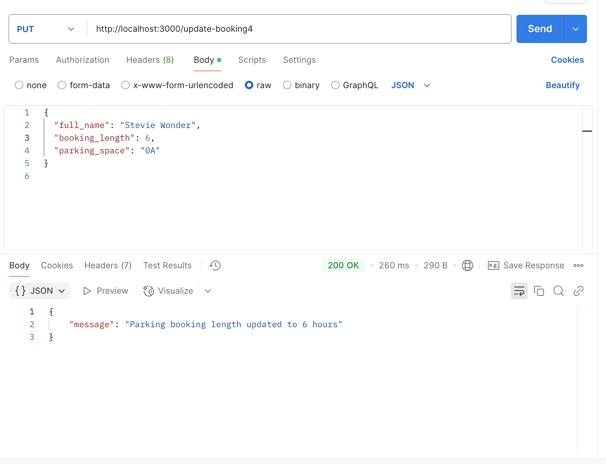
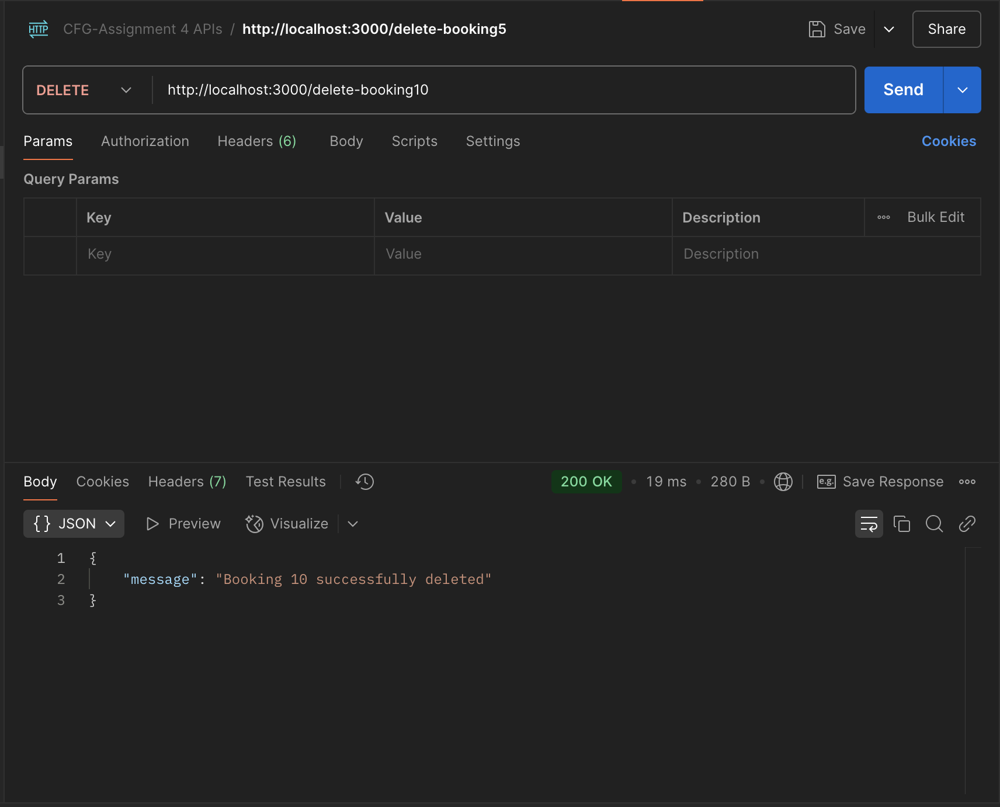

# Parking Spotz Car Park

## The API that allows you to book a parking spot for your car in the city right now!

### Getting started

- To view, run and use this API, please download this repository to your local machine using `git clone` and the URL.
- Open up your code editor and ensure that you are in the correct working directory for this project locally. In your terminal type `cd Assignment4` or the local file path for this project.

### Prerequisites

Please ensure you have the following prerequisite programmes installed on your computer in order to run this project.

- Node.js
- MySQL Workbench (for the database)
- Postman (if the brower version isn't working for you, please ensure you have the desktop app.)

### Running the database

First we'll need to make sure our database is up and running. To do this:

- Open MySQL Workbench and connect with your credentials
- Open up the `car_park.sql` file
- Run all the commands in the file by pressing the ⚡️ button
- You should have all green ticks ✅ in the action output terminal. This means everything has run correctly.

### Creating a .env file to handle sensitive information

For security reasons, a .env file that stores the database credentials for this project has not been pushed to GitHub, however it is required to run the project. 

In your local working directory for this project, create a new file on the same level as all the other project files and name the file `.env`\
Your .env file should contain the following text. Ensure the format is the same as below.

> DB_USER=user\
> DB_PASSWORD=yourmysqlpasswordhere\
> DB_DATABASE=databasename

Change the credentials to match your MySQL credentials. The name of the database should match the name of the SQL file in this project (with no file extension). Save this file. 

### Installing dependencies

Now back to your code editor. In your terminal, run the following commands:

- Initialise the project\
`npm init -y`

- Install dependecies\
`npm install express cors body-parser dotenv mysql2`

Upon installing the dependencies, package.json and package-lock.json files will be generated. I've included these files alongside the project files in this repository just in case. Please ensure your package.json file look exactly like the one in this project. 

When installing Node.js, node modules will also be generated. We can ignore these for the sake of this project. To do this:\
- Create a `.gitignore` file on the same level as the project files
- Type `node_modules` in the .gitignore file, and save.

### Running the API

- Open the `cp_index.js` file in your code editor
- In the terminal run the command `npm start` 

If the server is connected, it should log a message in the console indicating the port it is running on.   
We'll be using port 3000.  
If the .env is functioning correctly, the DB_USER value will also be logged in the console.\
This means everything is working correctly.

- Open your browser (best to use Google Chrome for this) and enter the local address `http://localhost:3000/` to ensure the API is running in the browser.

If there is a server side error with any of our requests, it will return an HTTP code with status 500 or 501. This indicates that something has either not been set up correctly with our dependencies, our code, or our database, or that there is another server issue.

### Testing the endpoints

Our endpoints are added to the URL in the browser and in Postman to test that they are working. To make sure everything is connected, we can try the `/home` endpoint which should return our homepage welcome message. Check this URL `http://localhost:3000/home` in the web browser and you should see the welcome message. Only GET and PUT requests can be viewed in the browser., which is why we'll be testing most of our endpoints in Postman.

Let's a look at the `/home` endpoint again.\
In Postman:

- select GET for the type of API request, and ensure the URL matches the endpoint that is being tested, in this case `http://localhost:3000/home`. 

- Click send, and you should get a successful response with HTTP code 200 OK, as below.\

POST and PUT requests require a request body with some information. We will input this as JSON. Make sure to click **Body** and select **raw** in Postman, and then type in your request body as JSON. GET and DELETE requests do not need require a request body.

### How the API works

The API is intended to allow users to book a parking space in a car park. 

First we need to see the available spaces in the car park. We can check this by sending a GET request to `http://localhost:3000/parkingspaces` or the `/parkingspaces` endpoint.

A successful request should return a result like the one below in Postman.\

Next we can book a parking space by sending a POST request to the `/create-booking` endpoint. This request requires a request body as JSON with the full name of the user, the length of their booking in hours, and the name of the parking space they wish to book. 

Here is an example:
> {\
> "full_name": "Cinderella",\
> "booking_length": 48,\
> "parking_space": "0W"\
> }

Depending on whether the request is successful, or if there is an error, it will return the corresponding HTTP status code. Once the booking is made, that parking space will no longer be available.

Here are some examples of errors and their HTTP codes that can occur with the POST request to create a booking. These will occur if the parking space entered does not exist in our database, or if it is already booked.\

If our booking is successful, it should look like this:\

We can view all our bookings by sending a GET request to `/bookings`.\

We can update our booking by sending a PUT request to endpoint `/update-booking:id`. For example, if Cinderella wants to change the length of her booking, and her booking ID is 7, we will send a PUT request to `/update-booking7` with the request body as JSON, as below:

> {\
> "full_name": "Cinderella",\
> "booking_length": 36,\
> "parking_space": "0W"\
> }

Ensure the full name and parking space name in the request body match the original booking. 

The booking ID can be obtained from the results of `/bookings`.\
The ID is required for all PUT and DELETE requests.

A successful PUT request will look like this:\

If a user wants to cancel their booking, we can do this by sending a DELETE request to endpoint `/delete-booking:id`. For example, if Patrick Star wants to cancel his booking, and his booking id is 10, we will send a DELETE request to `/delete-booking10`.

Once successfully deleted, we should get this:\

Patrick's booking will no longer be in the list of bookings if we run another GET request for the `/bookings` endpoint.

### Ending the connection

To stop using the API and break the connection with the server, type `ctrl + c` in the terminal for both Mac and PC.
